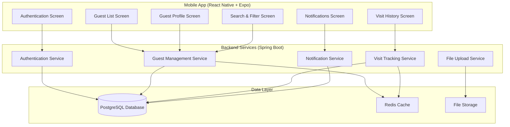
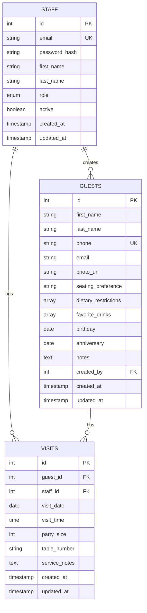

# Design Document

## Overview

The VIP Guest Memory System is designed as a full-stack mobile application with a React Native frontend and Spring Boot backend. The architecture follows RESTful API principles with JWT-based authentication, ensuring secure and scalable operations for restaurant staff. The system prioritizes performance and offline capabilities to function effectively in busy restaurant environments.

## Architecture

### High-Level Architecture



### Technology Stack

**Frontend (React Native + Expo)**
- React Native 0.72+ with Expo SDK 49+
- React Navigation 6 for screen navigation
- React Query for API state management and caching
- AsyncStorage for local data persistence
- Expo Camera for photo capture
- React Hook Form for form management
- React Native Paper for UI components

**Backend (Spring Boot)**
- Spring Boot 3.1+ with Java 17
- Spring Security with JWT authentication
- Spring Data JPA for database operations
- Spring Web for REST API endpoints
- PostgreSQL driver
- Redis for session management and caching
- Cloudinary or AWS S3 for image storage

**Database & Infrastructure**
- PostgreSQL 15+ for primary data storage
- Redis 7+ for caching and session management
- Docker for containerization
- Nginx for reverse proxy (production)

## Components and Interfaces

### Mobile Application Components

#### Authentication Module
- **LoginScreen**: Email/password authentication with role selection
- **AuthContext**: React Context for managing authentication state
- **TokenManager**: Handles JWT token storage and refresh
- **RoleGuard**: Component for role-based route protection

#### Guest Management Module
- **GuestListScreen**: Displays paginated list of guests with search
- **GuestProfileScreen**: Create/edit guest profiles with photo upload
- **GuestCard**: Reusable component for displaying guest summary
- **PhotoCapture**: Camera integration for guest photos
- **PreferencesForm**: Form for dietary restrictions and preferences

#### Visit Tracking Module
- **VisitHistoryScreen**: Timeline view of guest visits
- **VisitLogForm**: Form for logging new visits with notes
- **VisitCard**: Component for displaying individual visit details
- **NotesEditor**: Rich text editor for visit notes

#### Search and Navigation
- **SearchBar**: Real-time search with debouncing
- **FilterModal**: Advanced filtering options
- **NavigationTabs**: Bottom tab navigation
- **NotificationBadge**: Displays pending notifications

### Backend API Endpoints

#### Authentication Endpoints
```
POST /api/auth/login
POST /api/auth/refresh
POST /api/auth/logout
GET  /api/auth/profile
```

#### Guest Management Endpoints
```
GET    /api/guests?page={page}&search={query}&filter={filter}
POST   /api/guests
GET    /api/guests/{id}
PUT    /api/guests/{id}
DELETE /api/guests/{id}
POST   /api/guests/{id}/photo
```

#### Visit Tracking Endpoints
```
GET  /api/guests/{id}/visits
POST /api/guests/{id}/visits
PUT  /api/visits/{id}
DELETE /api/visits/{id}
```

#### Notification Endpoints
```
GET /api/notifications/upcoming
GET /api/notifications/special-occasions
POST /api/notifications/{id}/acknowledge
```

## Data Models

### Database Schema

```sql
-- Staff table for authentication
CREATE TABLE staff (
    id SERIAL PRIMARY KEY,
    email VARCHAR(255) UNIQUE NOT NULL,
    password_hash VARCHAR(255) NOT NULL,
    first_name VARCHAR(100) NOT NULL,
    last_name VARCHAR(100) NOT NULL,
    role VARCHAR(20) NOT NULL CHECK (role IN ('HOST', 'SERVER', 'MANAGER')),
    active BOOLEAN DEFAULT true,
    created_at TIMESTAMP DEFAULT CURRENT_TIMESTAMP,
    updated_at TIMESTAMP DEFAULT CURRENT_TIMESTAMP
);

-- Guests table for customer profiles
CREATE TABLE guests (
    id SERIAL PRIMARY KEY,
    first_name VARCHAR(100) NOT NULL,
    last_name VARCHAR(100),
    phone VARCHAR(20) UNIQUE NOT NULL,
    email VARCHAR(255),
    photo_url VARCHAR(500),
    seating_preference VARCHAR(100),
    dietary_restrictions TEXT[],
    favorite_drinks TEXT[],
    birthday DATE,
    anniversary DATE,
    notes TEXT,
    created_by INTEGER REFERENCES staff(id),
    created_at TIMESTAMP DEFAULT CURRENT_TIMESTAMP,
    updated_at TIMESTAMP DEFAULT CURRENT_TIMESTAMP
);

-- Visits table for tracking guest visits
CREATE TABLE visits (
    id SERIAL PRIMARY KEY,
    guest_id INTEGER REFERENCES guests(id) ON DELETE CASCADE,
    staff_id INTEGER REFERENCES staff(id),
    visit_date DATE NOT NULL,
    visit_time TIME NOT NULL,
    party_size INTEGER DEFAULT 1,
    table_number VARCHAR(10),
    service_notes TEXT,
    created_at TIMESTAMP DEFAULT CURRENT_TIMESTAMP,
    updated_at TIMESTAMP DEFAULT CURRENT_TIMESTAMP
);

-- Indexes for performance
CREATE INDEX idx_guests_phone ON guests(phone);
CREATE INDEX idx_guests_name ON guests(first_name, last_name);
CREATE INDEX idx_visits_guest_date ON visits(guest_id, visit_date DESC);
CREATE INDEX idx_visits_date ON visits(visit_date DESC);
```

### Entity Relationships



### API Data Transfer Objects

#### Guest DTO
```json
{
  "id": 1,
  "firstName": "John",
  "lastName": "Doe",
  "phone": "+1234567890",
  "email": "john.doe@email.com",
  "photoUrl": "https://storage.example.com/photos/guest1.jpg",
  "seatingPreference": "Window table",
  "dietaryRestrictions": ["Vegetarian", "No nuts"],
  "favoriteDrinks": ["Red wine", "Sparkling water"],
  "birthday": "1985-06-15",
  "anniversary": "2010-09-20",
  "notes": "Prefers quiet atmosphere",
  "lastVisit": "2024-01-15T19:30:00Z",
  "visitCount": 12,
  "createdAt": "2023-12-01T10:00:00Z"
}
```

#### Visit DTO
```json
{
  "id": 1,
  "guestId": 1,
  "staffId": 2,
  "visitDate": "2024-01-15",
  "visitTime": "19:30:00",
  "partySize": 2,
  "tableNumber": "A5",
  "serviceNotes": "Celebrated anniversary, provided complimentary dessert",
  "staffName": "Jane Smith",
  "createdAt": "2024-01-15T19:30:00Z"
}
```

## Error Handling

### Frontend Error Handling

**Network Errors**
- Implement retry logic with exponential backoff
- Display user-friendly error messages
- Cache failed requests for retry when connection is restored
- Show offline indicator when network is unavailable

**Validation Errors**
- Real-time form validation with clear error messages
- Prevent submission of invalid data
- Highlight required fields and format requirements

**Authentication Errors**
- Automatic token refresh for expired sessions
- Redirect to login on authentication failure
- Clear stored credentials on logout

### Backend Error Handling

**Global Exception Handler**
```java
@ControllerAdvice
public class GlobalExceptionHandler {
    
    @ExceptionHandler(ValidationException.class)
    public ResponseEntity<ErrorResponse> handleValidation(ValidationException ex) {
        return ResponseEntity.badRequest()
            .body(new ErrorResponse("VALIDATION_ERROR", ex.getMessage()));
    }
    
    @ExceptionHandler(ResourceNotFoundException.class)
    public ResponseEntity<ErrorResponse> handleNotFound(ResourceNotFoundException ex) {
        return ResponseEntity.notFound().build();
    }
    
    @ExceptionHandler(UnauthorizedException.class)
    public ResponseEntity<ErrorResponse> handleUnauthorized(UnauthorizedException ex) {
        return ResponseEntity.status(HttpStatus.UNAUTHORIZED)
            .body(new ErrorResponse("UNAUTHORIZED", "Invalid credentials"));
    }
}
```

**Database Error Handling**
- Connection pool management with retry logic
- Transaction rollback on failures
- Duplicate key constraint handling
- Foreign key constraint validation

## Testing Strategy

### Frontend Testing

**Unit Tests**
- Component rendering tests using React Native Testing Library
- Utility function tests for data formatting and validation
- Custom hook tests for authentication and API calls
- Form validation logic tests

**Integration Tests**
- API integration tests with mock server responses
- Navigation flow tests between screens
- Authentication flow end-to-end tests
- Photo upload and caching functionality tests

**E2E Tests**
- Critical user journeys using Detox
- Login and guest creation workflows
- Search and filter functionality
- Offline mode behavior

### Backend Testing

**Unit Tests**
- Service layer business logic tests
- Repository layer data access tests
- Controller endpoint tests with MockMvc
- Security configuration tests

**Integration Tests**
- Database integration tests with TestContainers
- API endpoint tests with real database
- Authentication and authorization tests
- File upload service tests

**Performance Tests**
- Load testing for concurrent user scenarios
- Database query performance tests
- API response time benchmarks
- Memory usage profiling

### Test Data Management

**Development Environment**
- Seed database with realistic test data
- Multiple staff accounts with different roles
- Diverse guest profiles with various preferences
- Historical visit data for testing analytics

**Automated Testing**
- Factory pattern for generating test entities
- Database cleanup between test runs
- Mock external services (file storage, notifications)
- Consistent test data across environments

## Security Considerations

### Authentication & Authorization
- JWT tokens with 15-minute expiration and refresh token rotation
- Role-based access control (RBAC) for different staff levels
- Password hashing using BCrypt with salt rounds
- Account lockout after 5 failed login attempts

### Data Protection
- HTTPS enforcement for all API communications
- Input validation and sanitization on all endpoints
- SQL injection prevention through parameterized queries
- XSS protection with content security policies

### Privacy Compliance
- Data encryption at rest for sensitive fields
- Audit logging for all data access and modifications
- Data retention policies for guest information
- Secure file upload with virus scanning

### Mobile Security
- Certificate pinning for API communications
- Secure storage for authentication tokens
- Biometric authentication option for app access
- App transport security configuration